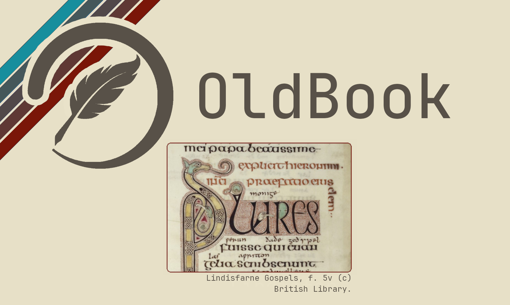
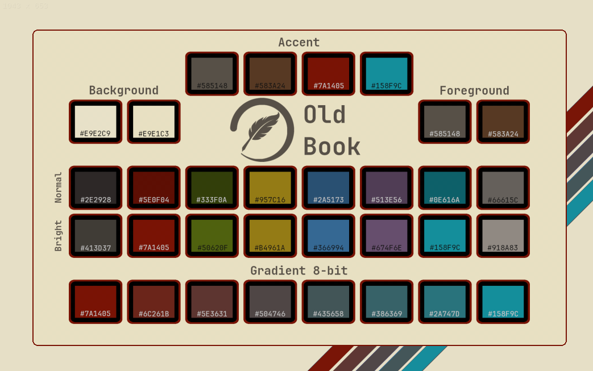
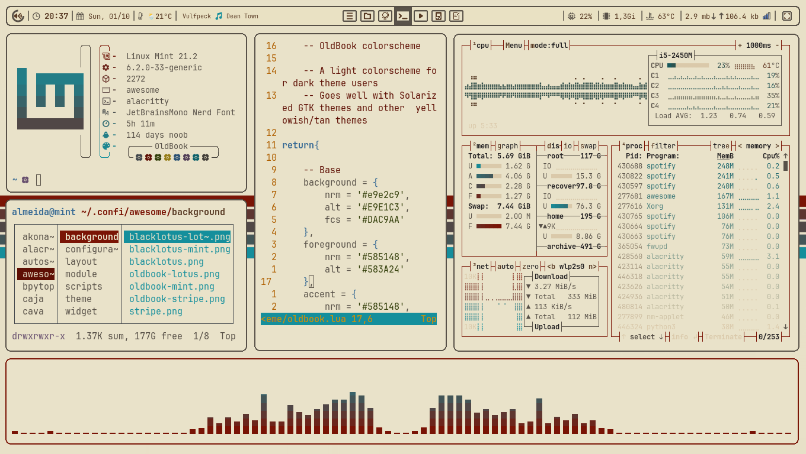
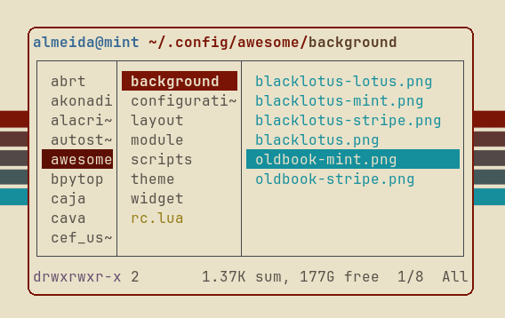
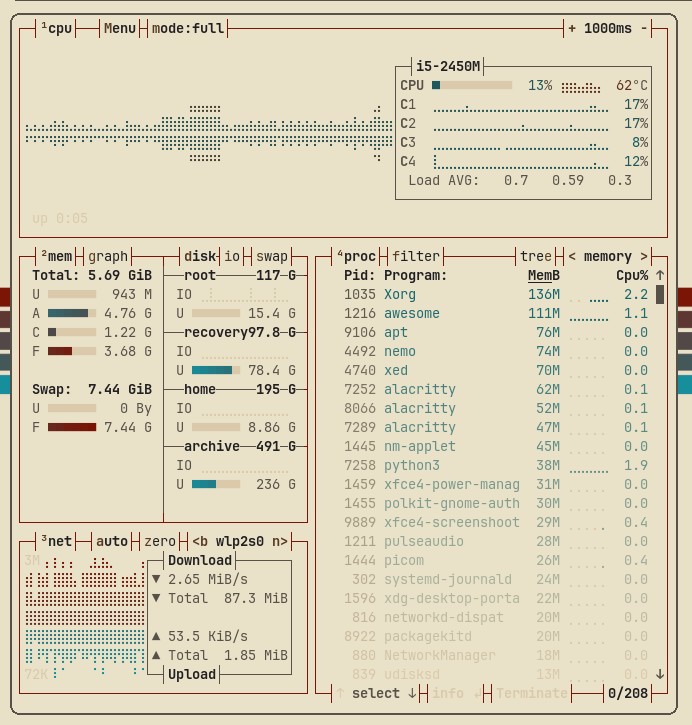
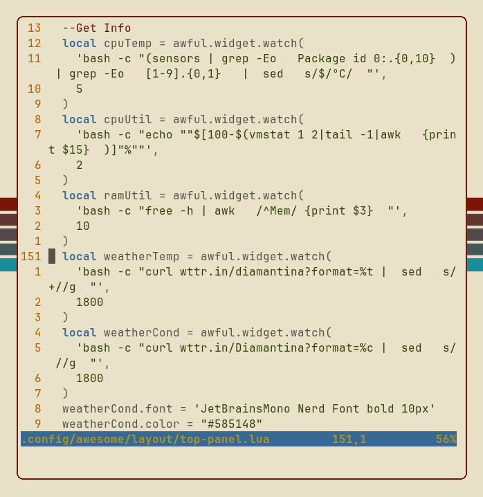

<h1 align="center"> BlackLotus,

<i>a colorscheme.</i> </h1>

_______

### Dark, dim, blue, purple... beautiful!

BlackLotus is a color theme inspired by Christopher Rush's MTG Black Lotus artwork.
The main colors are found in the lotus flower itself:
- reddish/purplish dark gray tones for background
-  yellowish/greenish dim white tones for foreground
-  dim or bright blue and purple options for accent color 

All colors were picked from the artwork directly, with just a few exceptions to build a cohesive palette.

_______

### You can find the complete Hex list <i>[here](https://github.com/PoisonIsBestType/BlackLotus/blob/main/hex-list.txt).

If you decide to apply this color scheme anywhere please consider sending us a screenshot to be featured here!</i>

_______

## Examples:
- Desktop

- Ranger

- BpyTOP

- Text

_______

## Screenshots

- ShakeyAZ (as seen on [Reddit](https://reddit.com/r/unixporn/s/6KRMk44m0q))

- Android

_______

<b>
Backgrounds 
</b>

_______

This repository contains a noob's side-project, don't expect much.
### Have a good one!
