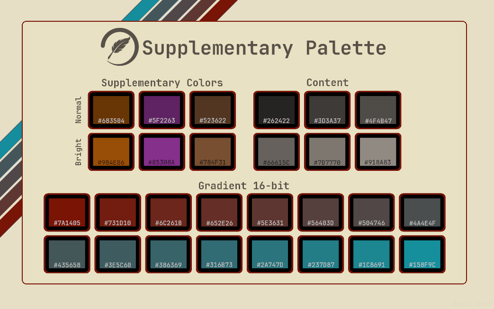
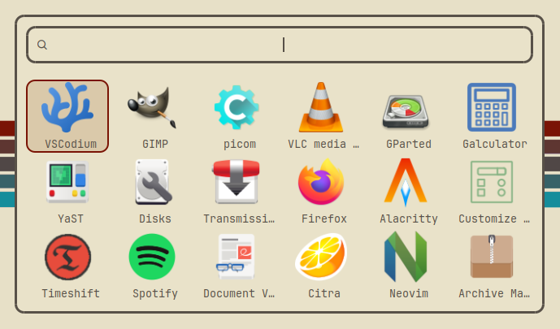
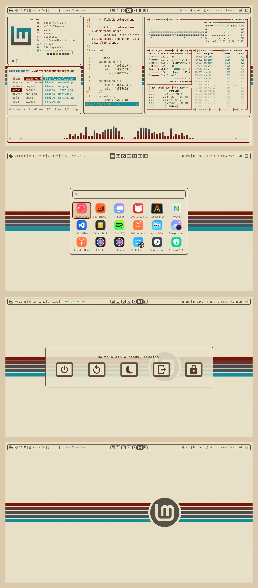
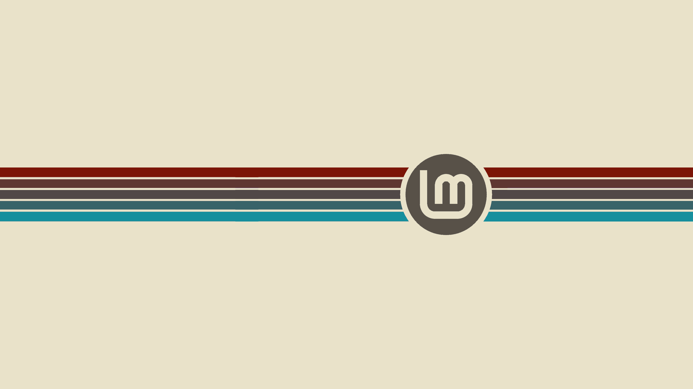

<h1 align="center"> OldBook,

<i>a colorscheme.</i> </h1>

_______

### A light colorscheme for dark theme users!

OldBook is a color theme inspired by the beautiful aesthetic of ancient caligraphy against aged tan paper. It's goal is to provide a cozy light colorscheme option, even to a dark theme user.

Looking for a "paper-like" desktop experience? OldBook is the way!

_______

### You can find the complete Hex list <i>[here](https://github.com/PoisonIsBestType/OldBook/blob/main/hex-list.txt).

If you decide to apply this color scheme anywhere please consider sending us a screenshot to be featured here!</i>

_______

## Examples:
- Desktop

- Ranger

- BpyTOP

- Rofi

- Text

_______

## Screenshots

- almeidaromim (as seen on [Reddit](https://www.reddit.com/r/unixporn/comments/16xincq/awesomewm_oldbook/))

_______

<b>
Backgrounds 
</b>

_______

This repository contains a noob's side-side-project, don't expect much.
### Have a good one!
