_______

<h3 align="center">A light colorscheme for dark theme users!</h3> 

OldBook is a color theme inspired by the beautiful aesthetic of ancient caligraphy against aged tan paper. It's goal is to provide a cozy light colorscheme option, even to a dark theme user.

Looking for a "paper-like" desktop experience? OldBook is the way!

_______

<h3 align="center">🎨 PALETTE 🎨</h3> 

_______

<h3 align="center">You can find the complete Hex list <i><a href="https://github.com/PoisonIsBestType/OldBook/blob/main/hex-list.txt">HERE</a></h3> 

If you decide to apply this color scheme anywhere please consider sending us a screenshot to be featured here!
</i>

_______

<h3 align="center">📷 GALERY 📷</h3>

 

<b>
Click here 
</b>

  
  

Desktop 

Ranger 

BpyTOP 

Rofi 

Text 

_______

<h3 align="center">🖼 SCREENSHOTS 🖼</h3>

 

<b>
Click here 
</b>

  
  

almeidaromim (as seen on <a href="https://www.reddit.com/r/unixporn/comments/16xincq/awesomewm_oldbook/">Redit</a>) 

_______

<h3 align="center">🌄 BACKGROUNDS 🌄</h3>

 

<b>
Click here 
</b>

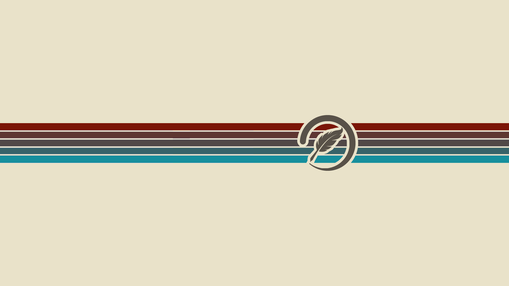
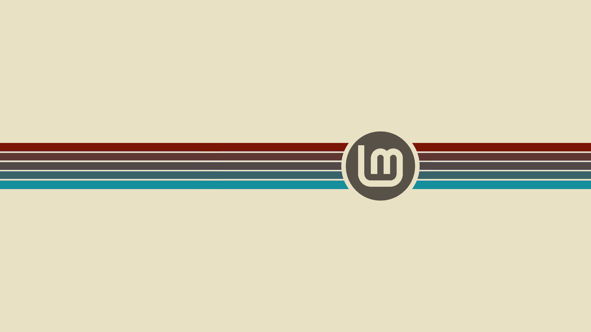
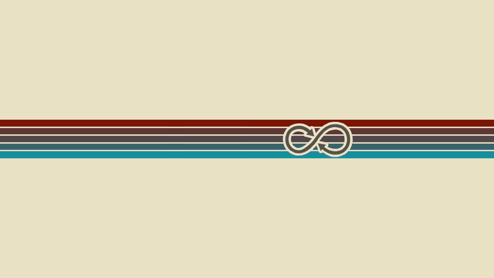

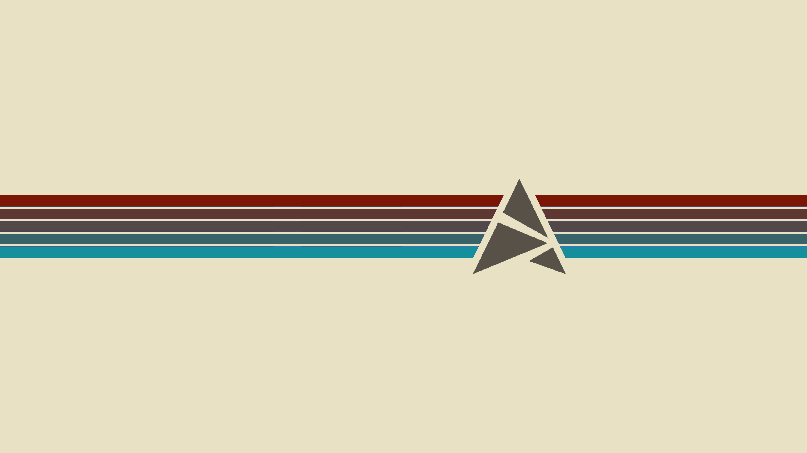
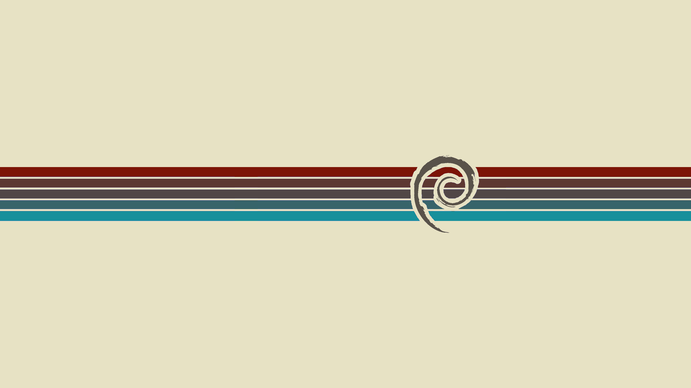
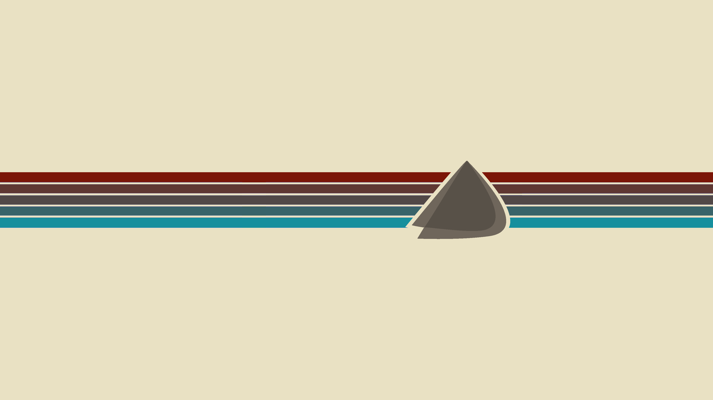

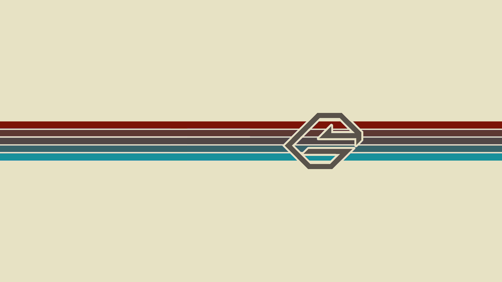
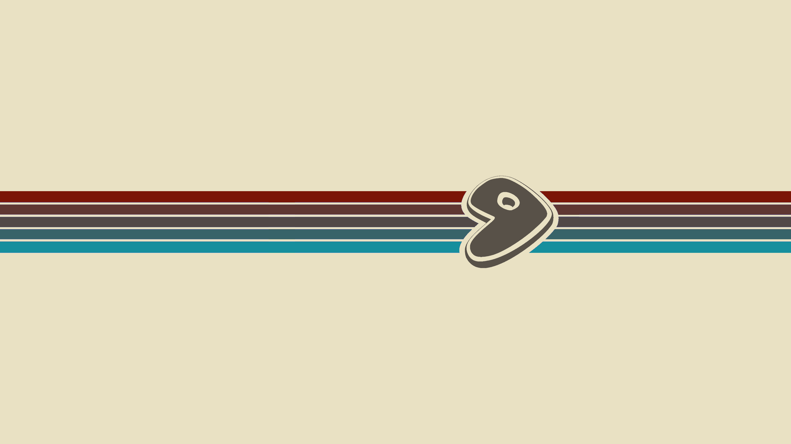
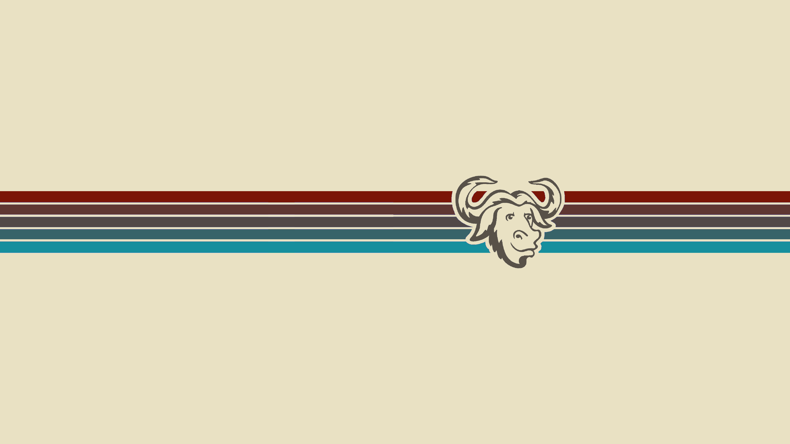

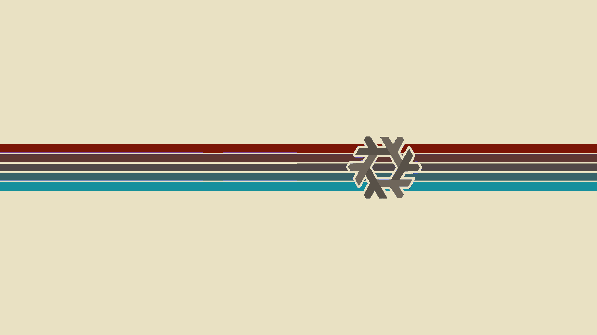
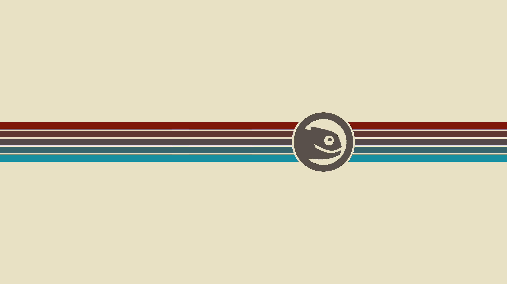
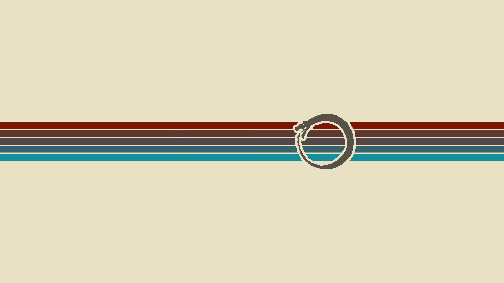

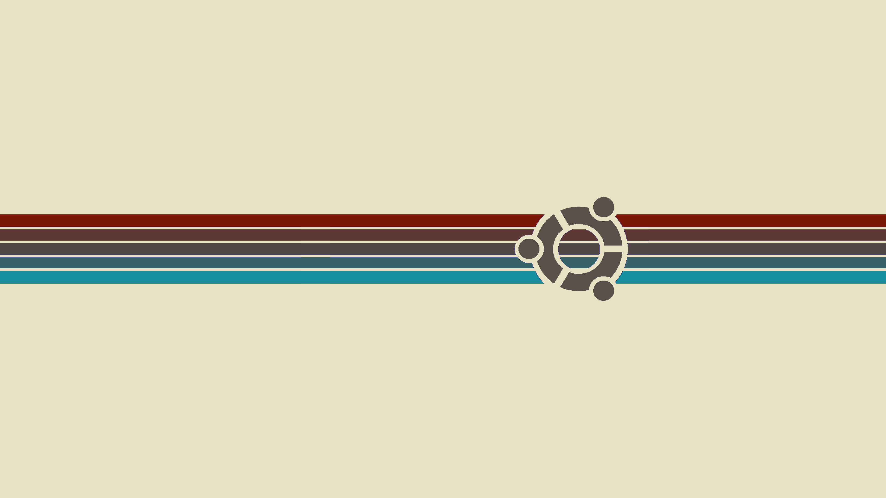

_______

This repository contains a noob's side-side-project, don't expect much!

Have a good one!

